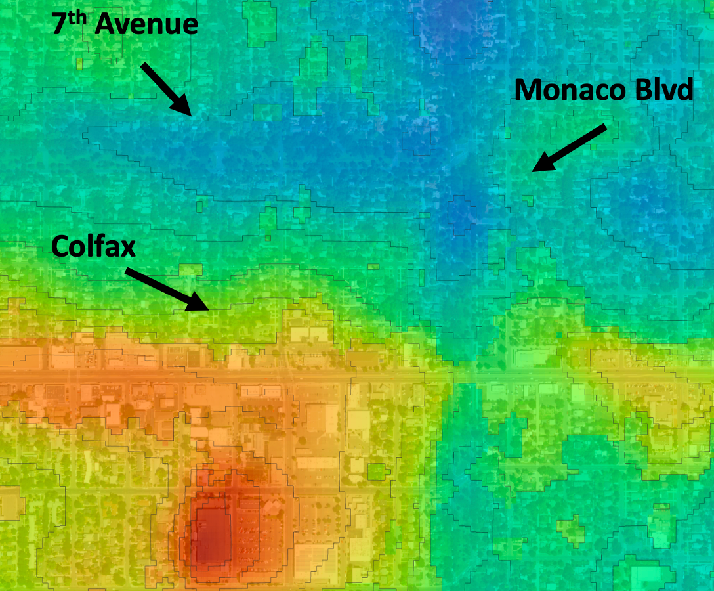

#  December 2, 2023 - Notes

In order to analyze imagery, I need a basemap of Denver at a high enough resolution.  Yesterday I downloaded about 200 GB of National Agricultural Imagery Program (NAIP) data.  I'm able to create a GDAL Virtual File (VRT) using a `EPSG:32613` projection with all the images.  This data is extremely memory intensive, and I've been looking to hopefully move towards a proper tiled dataset.  

To this end, I've created `utilities/lsp-create-geotiff-tileserver.py`.  This is a command-line application to take a folder of NAIP imagery and do the following:

1. Reproject all imagery into the exact same coordinate reference system.
2. Create overviews using `gdaladdo`.
3. Create VRT file
4. Run `gdal2tiles.py` on the full VRT file to create a "webserver" friendly visualization format.

After trying to use `gdal2tiles.py`, I ran into several problems.  Google Maps wants to use `EPSG:4326`, not the UTM projection.  This created a million issues in Python, as the resolution of the files become 0.00005, which creates math too small for Python to not round to zero.  I have a script, `scripts/reproject_to_4326.sh`, which takes a large folder of GeoTiffs and reprojects them to `EPSG:4326` and keeps them near native resolution.  It writes the results to a new folder.  You can use this as a preparation step for `lsp-create-geotiff-tileserver.py`.

## Cool Landsat LST Results

