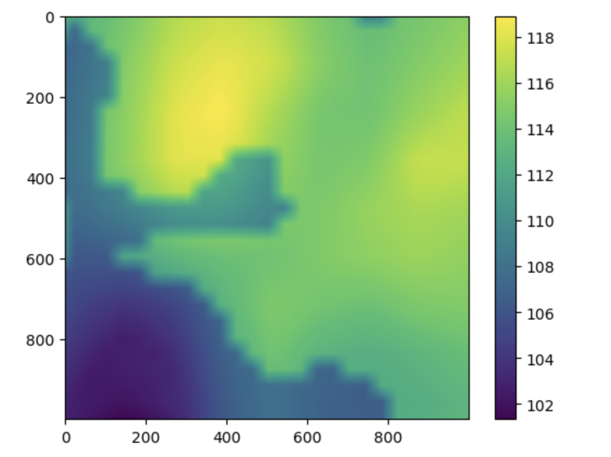

# December 7, 2023 - Notes

## Abandoning Tile-Server for USDA WMS

I ended up ditching the manual process using NAIP imagery and just stuck with the USDA Web-Map-Service (WMS) at [link](https://gis.apfo.usda.gov/arcgis/services/NAIP/USDA_CONUS_PRIME/ImageServer/WMSServer?service=WMS).  I forgot how easy it is to generate WMS calls.  See the Python code at `dug_api/wms.py`. 

## Heatmap Generation

After considerable pain, I got a reasonable workflow going with Matplotlib.  I strongly prefer Plotly, but I just can't get it working with Github-Pages.  



One huge frustration is that temps are in floating-point numbers, but in actual temp values.  Rendering imagery in floating-point data requires it typically be in the range of 0 to 1.  Once you convert to a proper pixel range, then it blows apart the colorbar for both Plotly and MPL.  I did some homework and found this gem...

```python
clcg_mosaic, r = merge_tiles( lst_arr, naip_arr, 0.75 )

fig, axs = plt.subplots( nrows=1, ncols=2, figsize=(16, 10), layout='tight', width_ratios=[15,1])

axs[0].imshow( clcg_mosaic )

ticks = np.arange( int(round(r[0])), int(round(r[1])), 4 )
norm = mpl.colors.Normalize(vmin=int(round(r[0])), vmax=int(round(r[1]))) 
sm = plt.cm.ScalarMappable(cmap=mpl.colormaps['jet'], norm=norm) 
sm.set_array([]) 

ls = np.linspace(int(round(r[0])), int(round(r[1])), 7 )

clb = fig.colorbar(sm, cax=axs[1], ticks = ls)
clb.ax.set_title('Land Surface Temp (F)')
```

[MPL Docs](https://matplotlib.org/stable/users/explain/colors/colorbar_only.html)

## Time Series Analysis

This is so far not going to plan.  I have a set of images I've run the numbers on and I'm getting weird results. 

```{image} ../../images/lst_example.gif
```

A LOT of the images I viewed had cloud cover.  Perhaps I need to show the color on the side for reference.