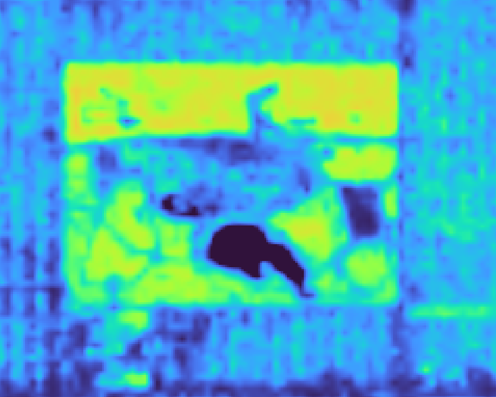
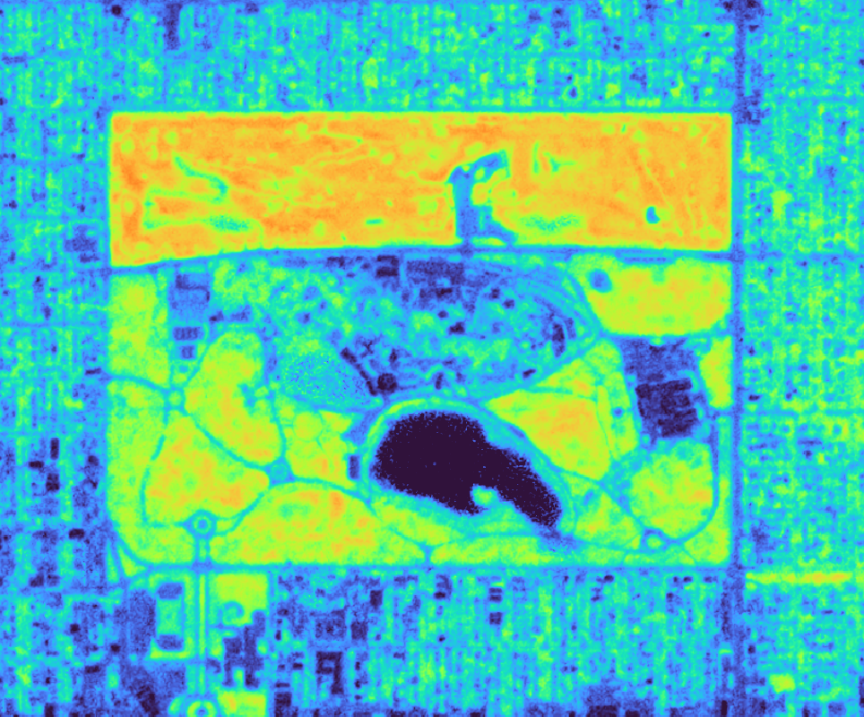

# December 24, 2024 - Status Updates

After getting accepted into the Planet Research Program, I've managed to download roughly 100GB of imagery.  The sensors do not provide enough bands to compute LST, but they do allow for NDVI.  The resolution quality is remarkable

  
  

According to Sobrano `cite here`, the radiance transfer function is defined by the following function...

$$
I_{i\theta} = B_i(T_{i\theta}) = \epsilon_{i\theta} B_i(T_S)\tau_{i\theta} + R_{ati\theta\uparrow} + R_i(ref)\tau_{i\theta}
$$

Where:

* `i` = Image channel
* `\theta` = Zenith observation angle

Jimenez `cite here` break this down into

$$
T_S = T_i + c_1 \cdot \left( T_i - T_j \right) + c_2 \cdot \left( T_i - T_j \right)^2 + c_0 + \left( c_3 + c_4\cdot W \right) \left( 1 - \epsilon \right) + \left( c_5 + c_6 W \right) \Delta \epsilon
$$

Where 

* $T_i$ and $T_j$ are the brightness temperatures. 
    * This is defined as the temperature in **kelvin**.  This is relevant because the Landsat TIRS bands 10 and 11 are in **pixel space** or $[0 \rightarrow (2^{16}-1)]$  You must multiply and add the linear coefficients from the Landsat MTL file. 
    * The Landsat coefficients are hard-coded, so the MTL file itself is not explicitly required.  `pylandtemp` can manage this itself.
    * `pylandtemp` is utilized for all brightness temp computations.

* $c_0$, $c_1$, and $c_2$ are 